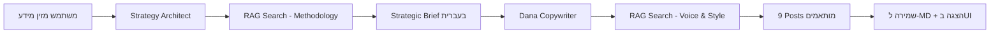

# 🧠 Dana's Brain - AI Marketing Content Generator

<div align="center">

**מערכת AI אוטונומית ליצירת תוכן שיווקי מותאם אישית בעברית**

[](https://www.python.org/)
[](https://www.crewai.com/)
[](https://chainlit.io/)
[](https://www.trychroma.com/)
[](LICENSE)

[English](#english) | [עברית](#hebrew)

</div>

---

## <a name="hebrew"></a>🇮🇱 עברית

### 📖 תיאור הפרויקט

**Dana's Brain** היא מערכת AI מתקדמת שמייצרת תוכן שיווקי מקצועי בעברית תוך שימוש ב-RAG (Retrieval-Augmented Generation) ו-Multi-Agent System.

המערכת מחקה את סגנון הכתיבה הייחודי של דנה (מנהלת שיווק ב-Lierac ישראל) ומייצרת תוכן מותאם לכל פלטפורמה: LinkedIn, Facebook ו-Instagram.

### ✨ תכונות עיקריות

- 🤖 **2 סוכני AI אוטונומיים:**
  - **Strategy Architect** - מנתח את המוצר ויוצר בריף אסטרטגי
  - **Dana Copywriter** - כותבת תוכן בסגנון של דנה
  
- 📚 **RAG (Retrieval-Augmented Generation):**
  - חיפוש סמנטי במסמכי ידע (מתודולוגיה, דוגמאות, סגנון)
  - ChromaDB כמסד נתונים ווקטורי
  - OpenAI Embeddings לחיפוש מדויק
  
- 📱 **9 פוסטים מוכנים לפרסום:**
  - 3 פוסטים ל-LinkedIn (מקצועי וחם)
  - 3 פוסטים ל-Facebook (אישי וסיפורי)
  - 3 פוסטים ל-Instagram (קצר וקליט)
  
- 🎨 **ממשק Chainlit אינטראקטיבי:**
  - טפסים דינמיים להזנת מידע
  - בחירת פרסונה (Professional, Friendly, Inspirational, Mentor)
  - שקיפות מלאה בתהליך העבודה של הסוכנים
  
- 💾 **שמירה אוטומטית:**
  - קבצי Markdown עם כל התוכן שנוצר
  - תיקיית `outputs/` עם timestamp וסימון ברור

### 🎯 תהליך העבודה



### 🛠️ טכנולוגיות

- **Python 3.10+**
- **CrewAI** - תזמור סוכני AI
- **Chainlit** - ממשק משתמש אינטראקטיבי
- **ChromaDB** - מסד נתונים ווקטורי
- **OpenAI GPT-4o-mini** - מודל LLM
- **OpenAI text-embedding-3-small** - Embeddings
- **LangChain** - כלי RAG

### 📦 התקנה

#### 1. שכפל את הפרויקט
```bash
git clone https://github.com/YOUR_USERNAME/AI_Final_151225.git
cd AI_Final_151225
```

#### 2. צור סביבה וירטואלית
```bash
python -m venv venv
# Windows
venv\Scripts\activate
# Mac/Linux
source venv/bin/activate
```

#### 3. התקן חבילות
```bash
pip install -r requirements.txt
```

#### 4. הגדר משתני סביבה
צור קובץ `.env` בתיקיית הפרויקט:
```env
OPENAI_API_KEY=sk-your-api-key-here
```

### 🚀 שימוש

#### הרצת המערכת
```bash
chainlit run start.py
```

הממשק ייפתח בדפדפן ב-`http://localhost:8000`

#### מילוי טופס
1. **Product Name** - שם המוצר
2. **Key Benefits** - יתרונות עיקריים
3. **Target Audience** - קהל יעד
4. **The Offer** - ההצעה
5. **Persona** - בחירת סגנון דנה

#### קבלת תוצאות
- ⏱️ זמן ריצה: 2-3 דקות
- 📊 פלט: בריף אסטרטגי + 9 פוסטים
- 💾 הכל נשמר אוטומטית ב-`outputs/`

### 📁 מבנה הפרויקט

```
AI_Final_151225/
├── agents/                      # הגדרות סוכני AI
│   ├── strategy_architect.py    # סוכן אסטרטגיה
│   └── dana_copywriter.py       # סוכן כתיבה
├── tasks/                       # משימות לסוכנים
│   ├── strategy_tasks.py        # משימת אסטרטגיה
│   └── copywriting_tasks.py     # משימת כתיבה
├── tools/                       # כלי RAG
│   └── txt_search_tools.py      # TXTSearchTool עם ChromaDB
├── Data/                        # מסמכי ידע
│   ├── Dana_Brain_Methodology.txt
│   ├── Dana_Voice_Examples_Lierac.txt
│   └── style_guide_customer_Lierac.txt
├── outputs/                     # פלטים שנוצרו
├── start.py                     # נקודת כניסה ראשית
├── chainlit.md                  # הודעת Welcome
├── requirements.txt             # תלויות
└── README.md                    # זה!
```

### 🧪 דוגמאות פלט

#### Strategic Brief (מקוצר)
```
### PART A: THE DEEP DIVE
- Product Philosophy: למה המוצר הזה קיים?
- Simplified Science: איך זה עובד?
- Sensory Experience: איך זה מרגיש?

### PART B: STRATEGIC LENS
- The Gap: מה חסר ללקוח?
- Buying Barriers: מה מונע מהם לקנות?
- Psychological Trigger: איזה רגש מניע?
...
```

#### פוסט לדוגמה (LinkedIn)
```
היי אהובה,

האם את מרגישה שהעור שלך צמא לתשומת לב?

כולנו חוות רגעים שבהם העור שלנו מרגיש עייף, יבש ולא זוהר...

[150-200 מילים של תוכן מקצועי ואישי]

**CTA:** שתפי אותנו איך את מפנקת את העור שלך?
**Hashtags:** #טיפוח #עורזוהר
```

### ⚙️ תצורה מתקדמת

#### שינוי מודל LLM
ערוך את `agents/strategy_architect.py`:
```python
llm=ChatOpenAI(model="gpt-4o", temperature=0.5)
```

#### שינוי Embeddings
ערוך את `tools/txt_search_tools.py`:
```python
EMBEDDING_CONFIG = {
    "provider": "openai",
    "config": {
        "model": "text-embedding-3-large",  # שנה כאן
    }
}
```

### 🤝 תרומה לפרויקט

1. Fork את הפרויקט
2. צור branch חדש (`git checkout -b feature/AmazingFeature`)
3. Commit את השינויים (`git commit -m 'Add some AmazingFeature'`)
4. Push ל-Branch (`git push origin feature/AmazingFeature`)
5. פתח Pull Request

### 📝 רישיון

MIT License - ראה קובץ [LICENSE](LICENSE)

### 👤 יוצר

**Shahar** - [GitHub](https://github.com/YOUR_USERNAME)

### 🙏 תודות

- **Dana** - על המתודולוגיה והסגנון הייחודי
- **Lierac Israel** - על דוגמאות התוכן
- **CrewAI Team** - על ה-framework המדהים
- **Chainlit Team** - על הממשק המעולה

---

## <a name="english"></a>🇬🇧 English

### 📖 Project Description

**Dana's Brain** is an advanced AI system that generates professional Hebrew marketing content using RAG (Retrieval-Augmented Generation) and Multi-Agent System.

The system mimics Dana's unique writing style (Marketing Manager at Lierac Israel) and generates platform-specific content for LinkedIn, Facebook, and Instagram.

### ✨ Key Features

- 🤖 **2 Autonomous AI Agents**
- 📚 **RAG with ChromaDB**
- 📱 **9 Ready-to-Publish Posts**
- 🎨 **Interactive Chainlit UI**
- 💾 **Auto-Save to Markdown**

### 🚀 Quick Start

```bash
# Clone
git clone https://github.com/YOUR_USERNAME/AI_Final_151225.git
cd AI_Final_151225

# Install
pip install -r requirements.txt

# Configure
echo "OPENAI_API_KEY=your-key-here" > .env

# Run
chainlit run start.py
```

### 🛠️ Tech Stack

- Python 3.10+, CrewAI, Chainlit, ChromaDB, OpenAI GPT-4o-mini

### 📄 License

MIT License

---

<div align="center">

**Made with ❤️ and 🤖 by Shahar**

[⬆ Back to Top](#-danas-brain---ai-marketing-content-generator)

</div>

